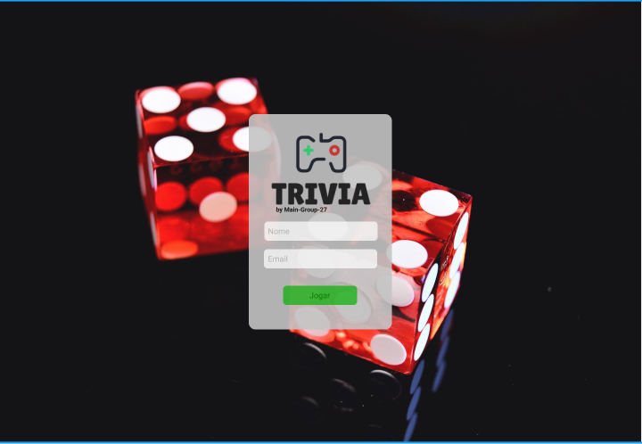
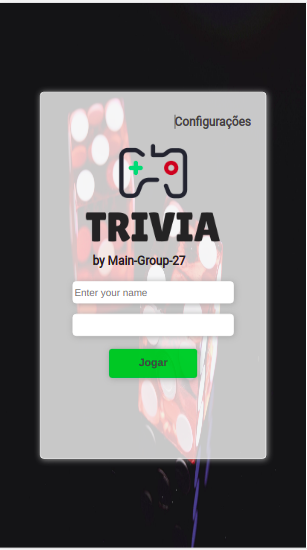
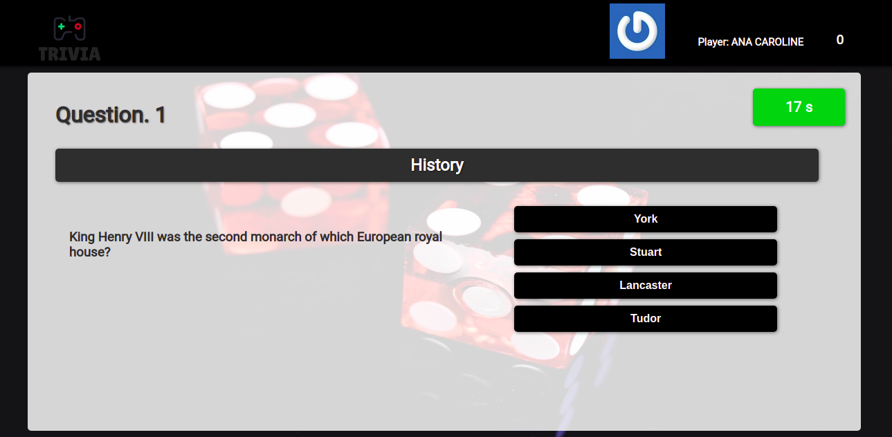
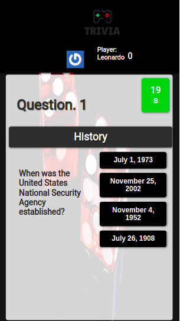
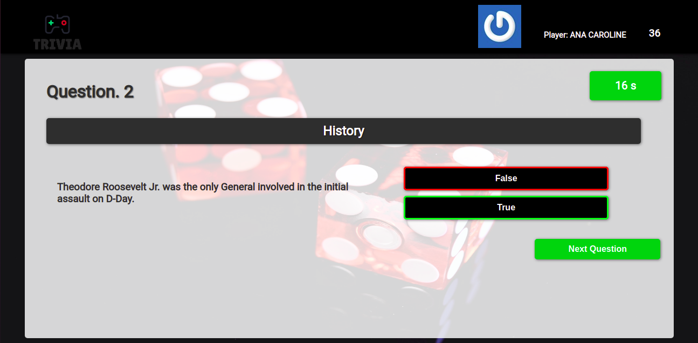

# Welcome to Trivia!

## https://trivia-guess-game.vercel.app/

#### Desktop / Mobile /Login<br><br>
---
 <br><br>

#### Desktop / Mobile /Game<br><br>
 <br><br>
 


In this project, you need to be able to:

  * Create a Redux Store in React app;

  * Create Redux reducers in React app;
  
  * Create Redux actions in React app;
  
  * Create Redux dispatchers no Redux in react app;  
  
  * Connect Redux with React components;
  
  * Create async actions in React apps where you have a Redux.

---

# Deliverable

## What you should develop

You should develop a game of questions and answers based on **Trivia**, an american show, using React and Redux.
The functionalities should be done by the team (4) according to the Kanban board. 
To get close to a real job environment, you should copy this board and use it with the team.

In this app, the user should find the following functionalities:

- Login functionality, and if the email is in Gravatar(https://pt.gravatar.com/) service, the player photo should be associated.
- Getting in the game page, chose an answer to the current question. The answer shoulde be chosen befores the counter get in 0, so the answer will be considered wrong.
- After answer 5 questions, the player should be redirect to score page, where an text will be displayed according to the score.
- A ranking page can accessed after each game.
- To configure some previous preferences accessed by the game header.
  
## Workflow

You can find a pattern for the project in this link https://www.figma.com/file/9XUqIwKEFBfbZn5t8MMZJY/Trivia---project?node-id=0%3A1.

**The UI can be customized.** 


---
### Trivia API 

The [Trivia API](https://opentdb.com/api_config.php) is very simple. We are gonna use 2 endpoints for this project.

* **Get the player token for the session**(https://opentdb.com/api_token.php?command=request)
* **Get random questions and answers**(https://opentdb.com/api.php?amount=5&token=${seu-token-aqui})

```
The token gets off after 6 hours and will return code 3

### Gravatar

The Gravatar ir a service that allows a global avatar accordding to a registered email, and the photo of the user will be displayed in any partner website.
---

# Project requirements

### Login page

#### 1. Creat a login page, and the player needs to input information in it to start the game.

 - Create a page to identify the user, with name and email. It will be the inicial page of your app. 
 - The 'start' button should be disable as long as the information is not valid.

 * You should create a field to the player to input the name and one for the email.<br>
 * Use the following data-testid `data-testid="input-player-name"` for the name, and `data-testid="input-gravatar-email"` for the email.
 * Use 'data-testid="btn-play" for the start button. The text should be "Jogar".
 - The 'start' button should be disable as long as the information is not valid.  

#### 2. Create the 'Jogar' button

  - The button should require an API service a token and redirect the player to the game page

  * After the click event, the player should be redirected to the game page
  * In the click event, a require should be made do Trivia API to get the player token
  * The token should be saved in app and used in the following requirements
  * Save the token in the `LocalStorage`, using thekey `token`  

#### 3. Create a button that leads the player to a setting page

  - The inicial page should have a button to redirect to settings page

  * Use `data-testid=`btn-settings``
  * The settings page should have a title with the attribute `data-testid=`settings-title``

### Game page

#### 4. Create a header element with the player data

  - The header should have the name, the gravatar photo and the socre of the player
  
  * The profile picture should be provided by the gravatar, use `data-testid=`header-profile-picture``
  * The player name should have the attribute `data-testid=`header-player-name``
  * The inicial score should be 0. Use `data-testid=`header-score``
 
#### 5. Create the game page with the question information

  - A requirement to the API should be done to get the questions, category and alternatives

  * The question category should have the attribute `data-testid=`question-category`
  * The question should have the attribute `data-testid=`question-text``
  * The alternative answers should follow the settings bellow:
    * The correct alternative should have the attribute `data-testid=`correct-answer``
    * The wrong alternatives should have the attribute `data-testid= `wrong-answer-${index}``, with `${index}` starting in `0`
    * The altertives should be displayed randomly
  
#### 6. The should be just one correct alternative for each question
 
#### 7. On click event in some alternative, the correct one should get green and the wrong ones should get red.

  * Use css attribute `border` with `3px solid rgb(6, 240, 15)` to the correct answer
  * Use css attribute `border` with `3px solid rgb(255, 0, 0)` to the wrong answer

#### 8. Create a 30 seconds timer to the player to answert he question

  - If the player doesn't answer the question in 30 seconds, the score should be considered 0 and the answer wrong.
  * Wrong answer score 0.  
  * After 30 seconds, the alternatives should be disabled.

#### 9. Create a scoreboard following the settings bellow: 

  - The current total score should be saved in the 'localStorage'
  - On click in the correct alternative, the player will score according to rules bellow  
  * The score rule is: `10 + (timer * difficulty)`, where timer is the rest of the timer time ans difficulty is `hard: 3, medium: 2, easy: 1`, According to the question. 

#### 10. A next button should be displayed after the player answer the question

  *  Use `data-testid=`btn-next``
  * After the click event on next button, the next question should be displayed

#### 11. The game should display 5 questions to the player

  - The game should be 5 questions, and for each new question the should be reset. 
  - After answering the 5 questions, the player should be redirect to the feedback page.

### Feedback page

#### 12. Create a header for feedback page following the settings bellow

 - The header should have the name, the gravatar photo and the socre of the player
  
  * The profile picture should be provided by the gravatar, use `data-testid=`header-profile-picture``
  * The player name should have the attribute `data-testid=`header-player-name``
  * The inicial score should be 0. Use `data-testid=`header-score``

#### 13. Create a feedback message to be displayed gor the player

  - The feedback page should display different message according to player performance

  * The message "Podia ser melhor..." if the player hit less than 3 questions
  * The message "Mandou bem!" if the player hit 3 or more questions
  * Use `data-testid=`feedback-text`
  
#### 14. Display the information of the session

  - The feedback page should display the total score and how many correct answers the player hit

  * Use `data-testid=`feedback-total-score` for the score
  * Use data-testid=`feedback-total-question`for the number of correct answers

#### 15. Create the play again option

   - The player should have the "Jogar novamente" option, and be redirect to the inicial pagae

  * The button should have the attribute `data-testid=`btn-play-again` 

#### 16. Create an option to the player to get in the ranking page

   - There should be a button to redirect to ranking page

  * Use `data-testid`=`btn-ranking`
  * The ranking page should have a title with the attribute `data-testid=`ranking-title`

### Ranking page

#### 17. create the ranking page

  - The ranking page should have a list, with the image, name and total score of the players and be saved at the local storage.

  * The list should be organized in decreasing order by the total score
  * Each list line should have `data-testid`=`player-name-${index}`, where `${index}` starts in 0
  * Each list line should have `data-testid`=`player-score-${index}`, where `${index}` starts in 0
 
#### 18. Create a button to lead to the beginning

  - The button should redirect to the login page 

  * Use `data-testid`=`btn-go-home`
  
---
